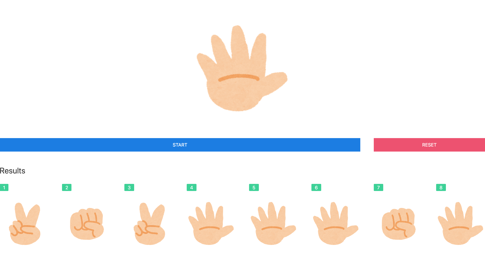

# rock-paper-scissors

忘年会などで利用できるJavaScriptのじゃんけんスクリプトです。  
サンプルは[こちら](https://hiyakayoyayo.github.io/rock-paper-scissors/)で動かしてみることができます。

### 使い方

Clone or Download よりzipファイルをダウンロードし解凍後、
index.htmlをブラウザで開くことで使うことができます。  

Startボタンを押すとじゃんけんがスタートし、Stopボタンを押すとストップします。  

Startボタンはクリックの他、スペースキーを押しても動作します。  
なお、履歴は内部保存していますが再起動後に再表示などは行っておりません。
リセットボタンをクリックすることで履歴をクリアします。  

### ダウンロード
[こちらから](https://github.com/hiyakayoyayo/rock-paper-scissors/archive/master.zip)

### 使用ライブラリ
[jQuery](https://jquery.com/)
[UIKit](https://getuikit.com/)

### 使用画像
[いらすとや](https://www.irasutoya.com/)様

### 動作環境
動作確認は、

- Chrome
- Safari
- Firefox

でしか行っていません。IEおよびEdgeでは動作しません。
なお、このプロジェクトをZipとしてダウンロードしてお使い頂ければ、
インターネット接続は不要です。

### ライセンス
MIT License
